# Connect 4 - Canine Edition

'Connect 4 - Canine Edition' is a website that aims to offer fun gameplay with increasing levels of challenge as you and your opponent improve. The website is themed around my own two dogs. Porgie & Kipper and their endless struggle for dominance. It's a themeatic twist on the familiar connect 4. The website is geared as a gift for my neice, Freya.

The target audience is a single individual, Freya. Freya is 5, nearly 6, and loves dogs, Porgie & Kipper in particular. She has a short attention span and loves games. She plays games alone but prefers to play with someone else.  

'Connect 4 - Canine Edition' includes a standard 6 x 7 grid version. The game is a 2 player turn based race to connect 4 adjacent dog tokens of the same type in a row. The game allows players to enter their names before starting play. There is a player score counter which tracks the number of wins for each player.

The live link can be found here - [Connect 4 - Canine Edition](https://rodocode.github.io/Connect4-CanineEdition/)

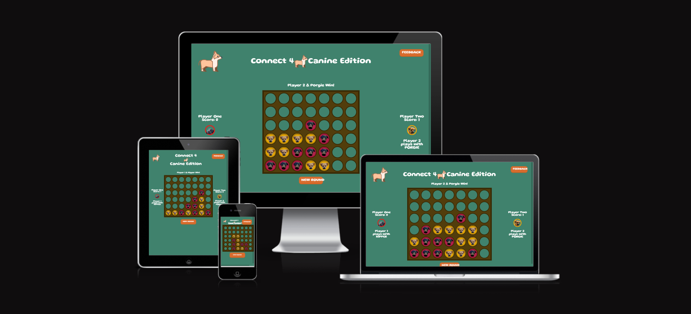

Freya is 5, so the content is styled to be appealing to her aesthetic tastes and all content is made accessible, intuitive and responsibly. A player only needs to be able to type their own name, be able to read simple sentences and have some spatial awareness within a digital space.

## Site Owner Goals

- To provide the user with joy.
- To provide the user with a challenging game of strategy appropriate to their skill level.
- To present the user with a website that is intuitive to use, fully responsive and gives the feeling of playing a personalised game.
- To encourage users to want to return to play again.

 

 
User Stories

- ### First time user

  - As a first time user I want to understand how to play the game.
  - As a first time user I want to feel that I am able to play strategically.
  - As a first time user I want to enjoy the experience and be surprised by features.

- ### Returning User

  - As a returning user I want to play strategically to win.
  - As a returning user I want to introduce another opponent to the game and its features.
  - As a returning user I want to get a higher score than my last highscore.

- ### Frequent User

  - As a frequent user I want to test the edges of the sites functionality and find it seamless.
  - As a frequent user I want to enjoy developing strategies to play well in the more challenging mode of the game.
  - As a frequent user I want to give feedback.

 

## Design

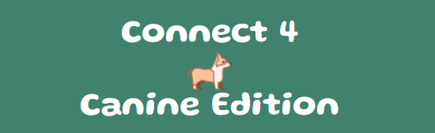

### Imagery

The images are either stock symbols and textures with accurate credits attributed or they are my own photographs edited to create game assets.

### Colours

The colour scheme of 'Connect 4 - Canine Edition' is meant to evoke feelings of dogs in a field, using veridian green, rgb(64, 130, 109), with pops of light bright colours reminiscent of flowers in a meadow and complimentary, #d65e18. This matches the styling of a lot of other childrens television and games, so the user intuitively recognises the context. This colour scheme requires careful curation so a high contrast between text and backgrounds for easy on screen reading is still maintained.

### Fonts

The Gluten font is used across the website. It is imported from [Google Fonts](https://fonts.google.com/). Sans Serif is the backup font, this allows the site cope with any import or compatibility issues with GoogleFonts.

## Wireframes

Balsamiq was use to generate the wireframes.

Desktop Wireframe

 

 

Mobile Wireframe

 

## Features

### Landing Page

This section introduces the user to ENIGMA with eye catching images to grab their attention and guide them on through the site. The page gives the user a rapid understanding of what the site is about and how they can use it. Users are met by a hero image with brief text introducing an interest and key element of the overall Enigma narrative.
There are different types of articles arrayed in several different sections to allow the user to feel how best they would like to learn.

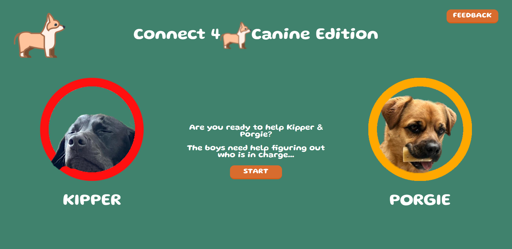

### Setup Page

Home, Gallery, Timeline, Articles - users come to the site with different levels of familiarity with the content so a range of different ways to navigate the content are crucial. Some allow the user to absorb and understand the content slowly as they navigate so that each section ahead makes sense while others are more direct for those that know what they are looking for.

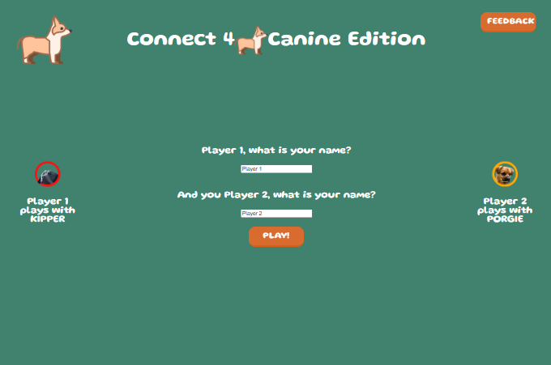

### Game Page

A collection of images with clear descriptions with hyperlinks to relevant pages where users can learn more. The images themselves are large and detailed, they are meant to be inspiring and interesting in and of themselves; a rare glimpse into the past.

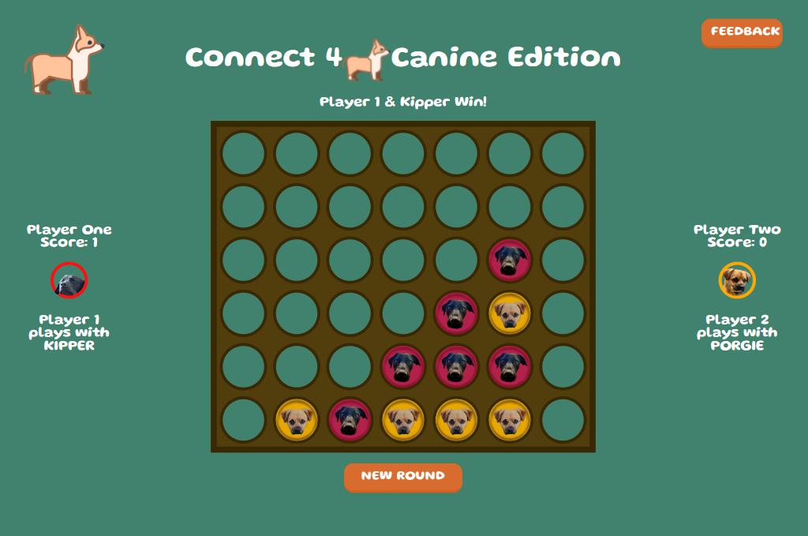

### The Header

The footer section includes links to relevant social media sites for Enigma . The links will open to a new tab to allow easy navigation for the user.
The footer also include site navigation links so users don't have to scroll to the top of the page.

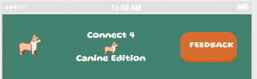

### Features to Implement in the Future

- Variable board size: this would allow players to change the shape of the board, increasing difficulty.
- Very simple AI for single player: this could have been done using a random number generator or mimicking the players moves to put a piece down next to theirs, so the AI plays defensively always trying to head off the players tactics. Maybe a tighter version of the win conditions looking for pairs of two and three to anticipate attempted wins, then the ai places its piece ahead to cut the player off.
- Highscores Page which tracks past players highest scores.
- Individual turn tracking for fastest win competing.
- Music

## Testing

### Validator Testing

- #### HTML
  - No errors were returned when passing through the official W3C Markup Validator
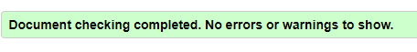
- #### CSS
  - No errors were found when passing through the official W3C CSS Validator
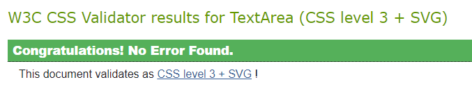
- #### Accessibility
  - The site achieved a Lighthouse accessibility score of 100% which confirms that the colours and fonts chosen are easy to read and accessible

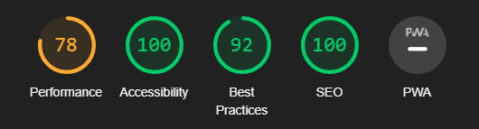

### Form Testing

- The feedback page has been tested to show that it will submit to the database, and reset if required.

### Links Testing

Testing has been conducted on all features of the Connect 4 - Canine Edition site up to its current status. All links lead to the relevant internal pages.

### Browser Testing

- The Website was tested on Google Chrome, Firefox, Microsoft Edge, Safari browsers with no issues noted.

### Device Testing

The site has been tested via dev tools on the full range of screens available there. The pages are responsive to changes in the desktop window size. The site has been tested on: 1920x1080 monitor, 1082x1048 monitor and an iPhone 13 Pro Max screen.

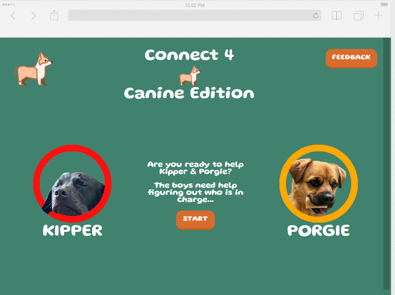

- I also used the following websites to test responsiveness:
  - [Responsinator](http://www.responsinator.com/?url=https%3A%2F%2Frodocode.github.io%2FConnect4-CanineEdition%2Ffeedback.html)
  - [Am I Responsive](https://ui.dev/amiresponsive?url=https://rodocode.github.io/Connect4-CanineEdition/game.html)

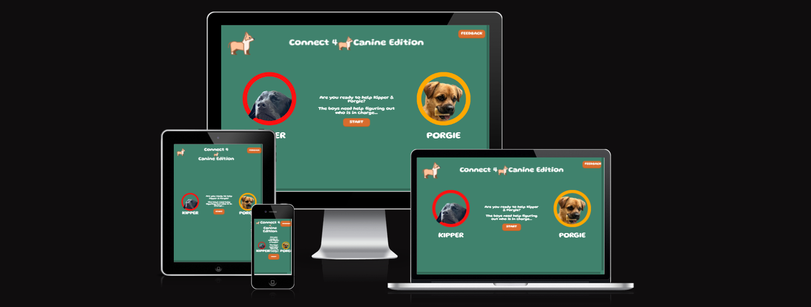  

### User Testing

Test users have been used and observed playing the game and testing th functions to find any bugs.

### Bugs list

- After incorporating the form values as active elements in the JS code the win condition for playrr two became 5 aligned matching divs in stead of 4. The game is connect 4, not connect 5, so this simply would do. This didnt effect player one. Player two also became the first to lay a tile unexpectedly. The bug was fixed by reverting to standard RED/YELLOW names to represent player one and two in code and passing their names value from the form separately into another variable which is used for in-game text.
- Hyperlinks in the buttons were only working when text was clicked, not the button itself. The links inside the button text field were removed and an inline attribute onclick was added as standard. This also mede styling the text of the button much easier.
- Score tracker wfist showed undefined, and after a fix to this it showed only 0. Score Updating function had to be written to clear the page and update with a new score after a win condition is found.

### Unfixed Bugs

- There is currently no end condition if the players reach a stalemate. While this does not effect gameplay as the rows are all full which stops any further play or bugs, and no win condition is reached so the scores are not changed by a draw, and there is a reset button permanently present for just such an occasion; I would still have prefered to create a draw status which is declared. Time was against me, maybe ill add it in the future. 
  
## Deployment

The site was deployed to GitHub pages. The steps to deploy are as follows:

1. In the GitHub repository, navigate to the Settings tab
2. Select 'Settings'
3. Select 'Pages'
4. Select the 'Branch' dropdown menu and select 'main'
5. Click 'Save'
6. Your site is now deployed (this is confirmed by a confirmation message)

The live link can be found here - [Connect 4 - Canine Edition](https://rodocode.github.io/Connect4-CanineEdition/)

### Frameworks - Libraries - Programs Used

- [Am I Responsive](http://ami.responsivedesign.is/) - Used to verify responsiveness of website on different devices.
- [Balsamiq](https://balsamiq.com/) - Used to generate Wireframe images.
- [Chrome Dev Tools](https://developer.chrome.com/docs/devtools/) - Used for overall development and tweaking, including testing responsiveness and performance.
- [GitHub](https://github.com/) - Used for version control and hosting.
- [Google Fonts](https://fonts.google.com/) - Used to import and alter fonts on the page.
- [Responsinator](http://www.responsinator.com/) - Used to verify responsiveness of website on different devices.
- [https://stackedit.io/app#] - Used to write Markdown for ReadMe
- [TinyPNG](https://tinypng.com/) - Used to compress images to reduce file size without a reduction in quality.
- [W3C](https://www.w3.org/) - Used for HTML & CSS Validation.

## Credits

### Thanks

My special thanks go out to Freya, Kipper and Porgie for inspiring this projects.

### Sources for images:

- logo from: www.toppng.com : opensource

### Formatting Techniques used to advise

- https://css-tricks.com/simplified-fluid-typography/
- https://stackoverflow.com/questions/45791714/element-styled-with-css-flex-box-appears-outside-parent-element-and-doesnt-vert
- https://www.w3schools.com/tags/att_button_form.asp
- https://www.digitalocean.com/community/tutorials/how-to-work-with-strings-in-javascript

